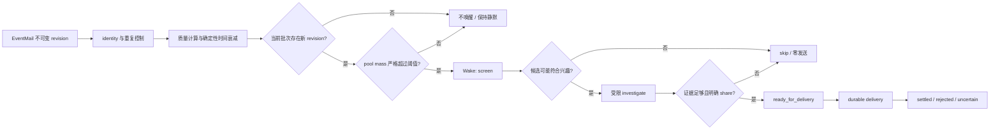

# 阶段 5：主动交互策略

## 5.1 30 秒入口

主动 Agent 和普通聊天最大的区别，是错误成本不一样。普通回答判断错了，通常只影响用户当前已经发起的这轮对话；主动系统判断错了，则可能在用户没有提问时主动制造打扰。所以我没有把“内容看起来相关”直接等同于“可以发送”，而是把主动交互拆成几个独立控制点：先通过事件版本、兴趣质量、时间衰减和阈值完成**程序化准入**，再经过 screen 和 investigate 两阶段决策，调查阶段使用受限工具核对证据，最后只能通过结构化的 `share` 或 `skip` 获得发送授权。普通 `final text` 没有主动发送权，只有合法的 Wake 终态调用才能推进领域状态；而且发送后还要等待真实 `delivery`，不能把生成成功当成送达成功。

## 5.2 2～3 分钟回答骨架

**问题：为什么这条内容值得打扰用户？**

我的判断是，相关性只是必要条件，不是发送条件。主动发送至少要分别回答四个问题：它是否符合用户兴趣，事实是否有足够证据，当前是否已经被发送或正在重复打扰，以及系统是否明确获得了发送授权。

**行动：怎样控制主动任务的成本和权限？**

第一层是程序化准入。EventMail 提供不可变的事件版本，系统根据 `kind`、`source_id`、`item_id` 和 `revision` 识别事件身份，只对新 revision 计算并持久化一次初始兴趣分，再结合确定性时间衰减和池阈值判断是否唤醒。启动 Wake 必须同时满足两个条件：当前批次存在新 revision，并且衰减后的 pool mass 严格超过阈值。旧 revision 可以留在池中贡献质量，但不能靠定时扫描单独触发新的 Wake。

第二层是模型决策，但仍然分成两步。`screen` 只有一步，只判断候选是否可能符合用户兴趣，并提出后续最值得确认的问题；它不调查外部事实，也没有外部调查工具。通过初筛的少量候选才进入 `investigate`，在固定 ReAct 预算内按需调用 `recall` 和 `fetch` 核实证据。

调查之后不能只生成一段推荐正文，而必须显式选择结构化的 `share` 或 `skip`。`share` 必须引用当前冻结候选批次中的真实事件项，`skip` 则表示主动保持安静。普通 final text、内部分析文字，或者一段看起来像推荐的正文，都不能触发发送。

**结果或复盘：发送以后怎样判断任务真的完成？**

`share` 是模型回合的决策终态，但对整个发送流程只会把所选内容推进到 `ready_for_delivery`。durable delivery 随后负责真实投递、消息投影和领域结算；只有最终进入 `settled`，本次主动交互才算完成。`skip` 则释放当前选择并保持零发送。投递被拒绝、durable delivery 的 `uncertain` 状态与已经结算必须分别表达；Wake 对尚未确认 `settled` 的结果保留为 `delivery_unknown`，不能据此盲目重发。

## 5.3 从事件进入到是否值得唤醒

主动内容从 EventMail 开始。EventMail 接收的是不可变 revision，而不是一个可以不断覆盖的普通对象。事件版本身份由 `kind`、`source_id`、`item_id`、`revision` 共同形成。这样做的原因是，主动任务需要区分“同一个事件版本再次到达”和“同一个条目产生了真正的新版本”。

标题去重不足以承担这个责任。标题可能因为轻微文字变化而漏掉重复内容，也可能因为标题没有变化而错杀真实更新。版本身份需要上游提供稳定 identity，程序才能对重复和更新作出可解释判断。相同 revision 的精确重复应复用已有身份；如果身份相同但内容发生冲突，则应 fail-loud，而不是静默覆盖。新 revision 可以成为新候选，但旧 revision 不能因为定时器再次扫描就恢复质量。

在程序化准入阶段，系统先处理事件 identity、revision、新旧状态、兴趣质量和时间衰减。历史实现中，Content 质量半衰期约为 36 小时，`WAKE_ADMISSION_FLOOR` 为 0.02，池阈值为 1.0，且必须严格超过阈值。这些是实现参数，不代表经过用户实验验证的全局最优值。它们的作用是控制模型成本和打扰风险：内容一旦随时间衰减到不足以进入池，就不应仅因为扫描任务再次运行而重新获得主动资格。

可以把这一段理解为“值得花模型成本”的判断，而不是“值得发送”的判断：

这里有一个重要的边界：程序化准入决定是否进入主动决策流程，但不代替兴趣判断、事实核验或发送授权。它只负责在模型调用之前，用确定性规则排除明显不值得调查的候选。

## 5.4 从兴趣初筛到有限证据调查

Wake 使用和普通回答相同的 ReAct 基础：模型提出行动，程序确认并执行工具，结果再回填给模型。但主动任务拥有独立的准入、受限的工具范围和明确的发送终态。模型看到某个工具，不等于当前任务允许执行；程序允许执行，也不等于工具已经真实产生效果。主动任务必须把这三层区分开。

### 一步 screen：只问“可能值得查吗”

`screen` 被限制为一步，最多选择 1～8 条候选。它的职责很窄：根据当前候选和已有上下文，判断哪些内容可能符合用户兴趣，并提出后续调查最值得确认的问题。

这一步不应调用外部调查工具。原因是兴趣初筛和事实核验的成本、证据要求不同。如果 screen 阶段直接打开网页或大规模检索，初筛就会变成没有边界的调查，既增加成本，也容易让模型在还没有明确兴趣判断时被外部细节带偏。screen 的结果只是缩小调查范围，不是推荐结论，更不是发送决定。

### investigate：只对少量候选补足证据

只有通过 screen 的少量候选，才进入受限调查。调查阶段可以按需调用记忆 `recall`，并在必要时通过来源或 `fetch` 核对原文。自动提供的记忆和候选都只是线索，不自动等于充分证据；存在来源只表示能够核实，不代表当前结论必然正确。

调查受到固定 ReAct 预算限制，历史实现中最多 20 个 ReAct 输出。有限预算的目的不是追求所有信息，而是要求模型围绕 screen 提出的问题补足最必要的依据，例如确认内容是否仍然新颖、摘要是否准确、候选是否与用户长期兴趣冲突，以及当前是否已经有相近内容被送达。

调查工具由当前 Wake 任务精确授权。前文工具治理中的 registered、visible、executable 仍然适用，但这里不展开整套工具发现机制：主动任务只应让模型看到并执行完成本次调查所需的工具，终态工具也必须显式纳入授权范围。工具调用、工具结果和最终状态都需要有可观察记录，这样才能区分“模型没有提出调查”“程序拒绝工具调用”“工具调用失败”和“调查后主动选择 skip”。

### 结构化 share/skip：把生成和授权分开

调查结束时，模型必须在 `share` 和 `skip` 之间作出结构化选择：

- `share` 表示证据和兴趣判断足以支持一次主动发送，但它必须引用当前冻结候选批次中的 1～5 个真实事件项；
- `skip` 表示当前不值得打扰，任务以零发送、静默方式结束。

冻结候选批次很关键。它约束了终态引用的范围，防止模型在调查过程中凭空生成一个不在当前任务里的事件，也防止候选集合变化后旧视图继续推进状态。`share` 不是“写一段文本”，而是当前模型回合中受程序校验的决策终态；它只把合法引用推进到 `ready_for_delivery`，并不代表整个发送流程完成。普通 `final text` 没有发送权，即使正文读起来非常像推荐，也只能被视为模型输出，不能推动领域状态。

## 5.5 代表性踩坑：相关内容不等于应该发送

### 现象

候选的标题或摘要与用户过去表现出的兴趣相似，模型因此直接生成了一段听起来合理的主动推荐。但它没有验证内容的新颖性、事实细节，也没有检查是否与用户的真实偏好或近期已送达内容冲突。

这不只是“文字可能不准确”。在普通问答里，用户已经主动发起了请求，错误内容主要影响当前回复；在主动系统里，用户没有提问，这段内容本身就可能成为一次真实打扰。即使推荐文字表达得很流畅，只要判断依据不足，系统就可能把低质量推断推到用户面前。

### 根因

根因是把兴趣判断和事实核验合并成了一次自由生成。原设计隐含了一个错误假设：只要内容“相关”，就等于证据充分，也等于值得打扰用户。这个假设忽略了候选可能过时、摘要可能不准确、用户兴趣也可能存在更具体的限制。

### 修复

修复的核心是把“可能感兴趣”和“证据足以支持发送”拆开。一步 `screen` 只筛选可能相关的候选，并为每条候选提出最值得确认的问题；它不核实事实，也不调用外部调查工具。只有通过初筛的少量候选才进入最多 20 步的受限调查，通过 `recall` 和 `fetch` 检查用户偏好、内容新颖性与原始依据。调查结束后再用 `share` 或 `skip` 表达结论，其中 `share` 必须引用冻结批次中的 1～5 个真实候选项。这样，兴趣相似不再被直接当成证据充分。

### 验证

回归路径需要确认，初筛请求只有 `screen_content`；调查请求才拥有 `recall`、`web_fetch`、`share_content` 和 `skip_content`。两个阶段的权限不能混在一起，否则 screen 可能越权调查，investigate 也可能绕过结构化终态。

终态校验还要覆盖以下情况：没有结构化终态、同时出现相互冲突的终态、空候选引用、批次外引用或重复引用时，都不能进入待发送状态，而应 defer 或保持不发送。正常端到端路径只有在合法的 share 引用和真实 delivery 完成后才进入 settled。

如果渠道投递已经开始但回执不确定，durable delivery 必须保留 `uncertain`，Wake 则把尚未确认 `settled` 的结果表达为 `delivery_unknown`；恢复流程不得据此自动重复发送。上述验证证明的是两阶段、授权边界和结算机制成立；它们不等于已经测得推荐准确率提升，也不等于已经证明误打扰率下降。推荐质量和用户体验仍然需要独立指标与真实数据验证。

## 5.6 事件版本、重复控制与 delivery 结算

主动任务不仅要控制“要不要发”，还要控制同一内容是否被重复处理、重复领取或重复发送。

### 版本与并发状态

EventMail 的不可变版本身份用于识别事件本身；snapshot 或 state version 则用于约束并发状态转换。它们解决的是不同问题：前者回答“这是不是同一个事件版本”，后者回答“当前状态视图是否仍然可以推进”。

例如，同一批候选不能同时被两个 Wake 实例领取；一个已经被新状态取代的旧视图也不能继续推进 share。状态版本检查失败时，应重新读取或结束当前尝试，而不是强行覆盖最新状态。这样可以避免定时扫描、重试任务和并发 Wake 共同把同一批候选推进多次。

这里需要区分两层状态。EventMail Content 的选择状态负责候选生命周期：`pending/deferred` 候选可以被领取为 `selected`；合法 `share` 将当前选择及其真实引用推进到 `ready_for_delivery`；`skip` 执行 `release`，结束本次选择但保持零发送；过期候选则进入 `expired`。这些状态回答的是候选是否还能被选择，以及当前选择推进到了哪里。

durable delivery 使用另一套状态表达真实投递：正常链路从 `prepared`、`provider_started` 经过 `delivered` 和 `projected`，最终进入 `settled`，失败或回执不确定则分别保留为 `rejected`、`uncertain`。Wake 返回的 `delivery_unknown` 是“尚未确认 settled”的上层结果，不是 EventMail Content 状态，也不等同于 durable delivery 中明确记录的 `uncertain`。

### 重复打扰控制

最近已送达的主动内容，以及受限的相关上下文，可以帮助模型判断当前是否正在重复打扰。例如，候选虽然新进入系统，但主题、来源或表达可能与刚刚送达的内容高度相近，模型应把这作为调查时的风险信号。

但这不应被夸张成硬编码的跨会话主题去重算法。这里的目标是给模型提供可解释的上下文，并结合事件版本和状态控制减少重复，而不是声称已经解决了所有语义重复问题。真正需要衡量的，是 revision 去重、旧内容拦截和重复打扰拦截在实际数据中的表现。

### 真实 delivery 与不确定性

`share` 成功只说明程序产生了合法决策并进入 `ready_for_delivery`，不说明渠道已经送达。durable delivery 负责记录真实发送的推进过程：明确成功后还要完成消息投影和领域结算，最终以 `settled` 表示闭环完成；明确拒绝记为 `rejected`；发送已经开始但回执无法确认时记为 `uncertain`。

Wake 在尚未观察到 `settled` 时返回 `delivery_unknown`。底层可能已经明确是 `uncertain`，也可能只是链路尚未完成，因此 `delivery_unknown` 不能反推某个唯一内部状态，更不能直接授权重发。恢复流程需要继续核对，或者依赖渠道幂等能力；否则回执丢失后的立即重试可能让用户收到两次相同内容。

## 5.7 结果、取舍与不足

我实现的是一条从不可变事件、程序化准入、两阶段调查、结构化 `share/skip` 到真实 delivery 结算的主动交互闭环。这个闭环把四个经常被混淆的问题拆开了：

1. 内容是否与用户兴趣相关；
2. 证据是否足够支持这次判断；
3. 系统是否明确获得发送授权；
4. 渠道是否真实完成 delivery。

因此，系统可以区分静默跳过、失败、真实送达和送达不确定，也可以避免普通回答因为“看起来像推荐”而自动获得主动发送能力。

其中的主要取舍是成本与风险之间的平衡。程序化准入尽量在模型调用之前过滤候选；screen 保持一步，只承担兴趣初筛；investigate 只对少量候选进行有限调查；结构化终态则把发送副作用交给程序校验。代价是有些内容会被 defer 或 skip，delivery unknown 也可能需要额外核对，但这些代价换来了更清楚的权限边界和更保守的主动行为。

历史参数中的 36 小时半衰期、0.02 准入底线、严格超过 1.0 的池阈值、screen 的 1～8 条候选、最多 20 个 ReAct 输出，以及 share 的 1～5 个引用，都是工程实现中的控制参数，不是用户实验得出的全局最优结论。当前可以确认的是状态、权限和恢复边界已经建立；推荐准确率、采纳率、负反馈率与误打扰率仍需通过独立实验和真实数据验证，具体指标统一进入全书的面试前准备清单。

## 5.8 高频追问

**问：为什么不让模型直接输出一段推荐文字，程序检测到 final text 后发送？**

因为 final text 只是生成结果，不是发送授权。这样会把兴趣判断、事实核验和领域状态推进重新合并，模型只要写得像推荐，就可能产生副作用。必须通过唯一、合法、结构化的 `share` 终态，并由程序验证候选引用和当前批次，才允许进入待发送状态。

**问：程序化准入是不是已经决定了内容值得发送？**

不是。它只决定内容是否值得花模型成本进入 Wake。兴趣初筛、事实证据和发送授权仍然要在后续阶段独立判断。否则阈值会被误解成推荐结论。

**问：为什么 screen 不直接调用网页搜索？**

因为 screen 的职责是低成本筛选兴趣，不是事实调查。让它调用外部工具会扩大成本和权限，也会让初筛阶段被细节牵引。只有进入 investigate 后，才在固定预算内使用 recall 或 fetch 核验证据。

**问：自动提供的记忆为什么不能直接作为证据？**

记忆或候选只是线索，可能过时、片段化，或者只支持用户曾经表达过某种兴趣。必要时需要 recall，并通过来源或 fetch 核对原文。即使找到来源，也只是说明可以核实，不能自动保证结论正确。

**问：为什么要使用 revision，而不是标题去重？**

标题去重既可能错杀真实更新，也可能漏掉文本变体。revision 依赖上游稳定 identity，能明确区分同一版本的重复到达和同一条目的新版本。相同 identity 出现冲突内容时应直接暴露问题，而不是静默覆盖。

**问：为什么旧 revision 不能在定时扫描时恢复质量？**

时间衰减表达的是内容随时间失去主动价值。如果旧 revision 每次扫描都重新获得初始质量，衰减规则就失去意义，过期内容也可能反复唤醒模型。新 revision 可以重新成为候选，因为它代表了新的事件版本。

**问：`selected` 是否代表已经发送？**

不是。`selected` 只表示候选已被任务领取。合法 `share` 先把引用推进到 `ready_for_delivery`，之后 durable delivery 还要完成真实发送、消息投影和领域结算，最终才进入 `settled`。把 `selected` 或 `ready_for_delivery` 当成已经完成，会掩盖发送拒绝和回执不确定。

**问：delivery unknown 为什么不直接重试？**

因为 `delivery_unknown` 只说明 Wake 尚未确认链路进入 `settled`，底层既可能处于明确的 `uncertain`，也可能仍在推进。请求可能已经送达但回执丢失，直接重试会造成重复打扰。应继续核对 durable delivery 状态，或依靠渠道幂等键确认后再决定是否重试。

**问：最近已经送达的内容能否完全阻止相同主题再次发送？**

当前设计把最近送达内容作为受限上下文，帮助模型判断是否重复打扰，但没有把它描述成完备的跨会话主题去重算法。是否应再次发送仍需结合 revision、新颖性、兴趣和证据判断，并通过数据观察重复拦截效果。

**问：最多 20 步调查是否意味着一定能得到正确推荐？**

不是。20 步只是历史实现中的 ReAct 预算，用于限制调查成本和工具调用范围。它不能证明证据一定充分，更不能推出推荐准确率或误打扰率。实际质量需要独立的离线评测和真实用户指标验证。

**问：如果模型同时返回 share 和 skip，应该怎么办？**

这不是合法的唯一终态。程序不能自行猜测模型意图，也不能选择其中一个继续发送，应拒绝推进、记录冲突并 defer 或保持不发送。主动系统宁可丢失一次可能的推荐，也不能在终态含义不确定时产生副作用。
